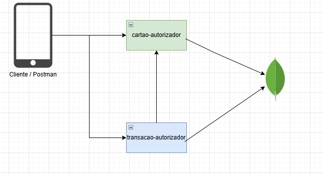
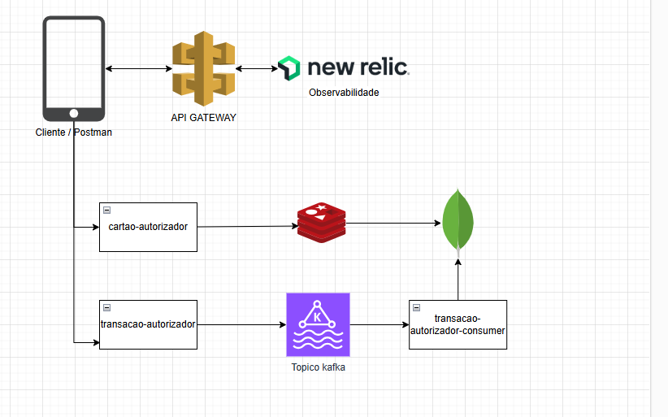

# Sistema de Autorização de Transações - VR Benefícios

Este repositório contém a implementação de dois microserviços: **Cartões** e **Transações**, parte de um sistema para autorização de transações de **Vale Refeição** e **Vale Alimentação**.

## Visão Geral

### **Microserviço Cartões**
Este serviço gerencia a criação de cartões, consulta de saldo e armazenamento de dados no banco MongoDB.

### **Microserviço Transações**
Este serviço processa as transações enviadas pelos usuários, validando a existência do cartão, a senha e o saldo disponível. Caso a transação seja autorizada, o saldo do cartão é atualizado e a transação é registrada.

---

## Arquitetura

A solução é composta por dois microserviços:

1. **Microserviço Cartões**:
    - Gerencia a criação, consulta de saldo e persistência de cartões.
    - Usa o **MongoDB** para armazenar informações dos cartões.

2. **Microserviço Transações**:
    - Processa as transações feitas pelos clientes.
    - Valida a senha e o saldo do cartão.
    - Conecta com o microserviço de cartões simulando a transação.

Além disso, a solução usa as seguintes ferramentas:

## Ferramentas Utilizadas

### **Backend**:

1. **Spring Boot**:
    - Framework para construir microserviços de forma simples e eficaz.

2. **MongoDB**:
    - Banco de dados NoSQL utilizado para armazenar informações dos cartões, como número do cartão e saldo.

3. **OpenAPI**:
    - Utilizado para documentar as APIs RESTful dos microserviços e gerar contratos de APIs.

4. **Spring Security**:
    - Usado para implementar autenticação básica via HTTP (Básica: `username`/`password`).

## Desenho Arquitetural Utilizado

## Desenho Arquitetural Para Resolver o Desafio

## Vantagens da  Arquitetura

1. **Escalabilidade**:
   - Kafka desacopla os serviços, permitindo o processamento de transações em grande escala.
   - Redis reduz a carga no banco de dados.
   - Configurar partições no Kafka para permitir múltiplos consumidores.
   - Adicionar DLQ no Kafka para lidar com eventos que falhem no processamento.

2. **Baixa Latência**:
   - Redis acelera consultas de saldo e dados do cartão.
   - Kafka melhora o desempenho em cenários de alto volume de transações.

3. **Resiliência**:
   - Mesmo que um serviço fique temporariamente fora do ar, Kafka garante que os eventos sejam processados posteriormente.
   - Com a utilização de um serviço de consumer, podemos garantir que as mensagens enviadas para o Kafka sejam idempotentes, ajudando a reduzir os problemas de concorrência. A lógica do consumer deve ser capaz de garantir que ela não afete o saldo do cartão mais de uma vez.

4. **Flexibilidade para Expansão**:
   - Novos serviços podem ser adicionados facilmente, como um serviço de notificação para avisar usuários sobre transações.

